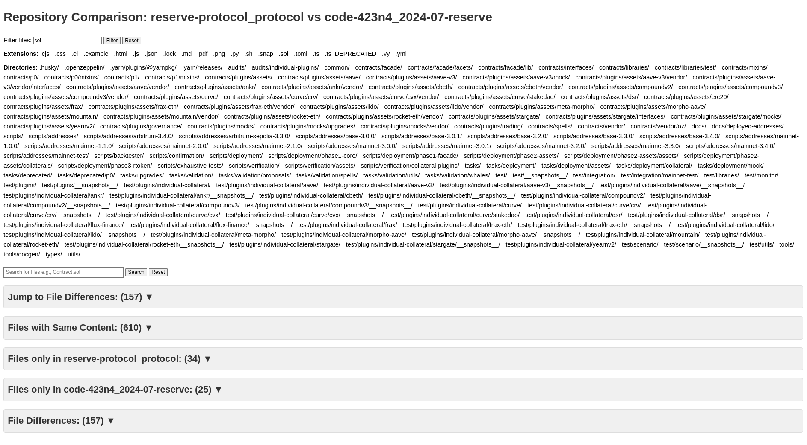

# Audit-Compare

Audit-Compare allows you to compare any two remote GitHub repositories for differences. The results are presented in an output HTML file, with options to filter by extensions and directories. Additionally, basic search functionality across the data is provided. 

## Installation

Requires `git` and `svn` (optional) installed on your OS.

1. Create a virtual environment:
    ```sh
    python3 -m venv venv
    ```
2. Install the required dependencies:
    ```sh
    python install -r requirements.txt
    ```

## Usage

Run the comparison script with the following command:
```sh
python compare.py <repo1> <repo2>
```
Alternatively, you can run the script and enter the repository URLs when prompted:
```sh
python compare.py
```
Optionally, you can use `--deep` flag to compare not only matching filepaths but filenames individually
```sh
python compare.py --deep
```

## Output

- Repositories are cloned into the `/data` directory.
- A new directory for the comparison operation will be created: `compare_<repo1>_to_<repo2>`.
- Open `comparison_report.html` in your browser to inspect the details.
- Additionally, a `repo_comparison_<date>.log` file will be created with all of the diff information.

## Screenshots

Examples uses:

repo1 = https://github.com/code-423n4/2024-07-reserve

repo2 = https://github.com/reserve-protocol/protocol

### Compare Filtering and Main View


### Compare Diffs Side-by-Side
